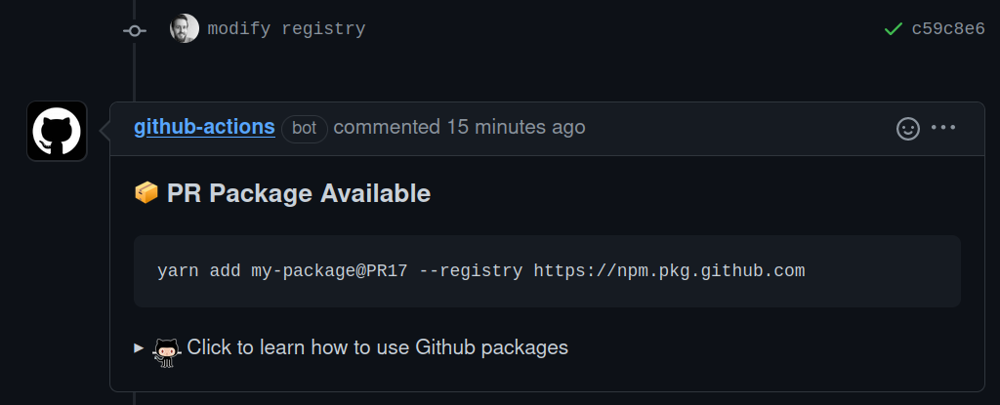

<h1 align="left">Welcome to Publish PR Packages 👋</h1>
<p align="left">
  <a href="#" target="_blank">
    
  </a>
</p>

> Auto-publish fresh packages for every pull request

<p align="left">

</p>

# Prerequisites

1. This tool requires lerna for versioning and publishing. You must install it in the root of your repo with the following command:

```bash
yarn add --dev lerna
lerna init
```

2. Next ensure your `package.json` includes the packages you want to publish in the workspaces: 

```json
{
  "workspaces": [
    "packages/*"
  ]
}
```

3. You must also copy the `/tasks` directory to the root of your repo. I'm open to suggestions/contributions to help eliminate this step!
# Usage


```yml
name: CI - Pull Request
on:
  pull_request:
    types: [opened, synchronize]
jobs:
  ci:
    name: PR Continuous Integration
    runs-on: ubuntu-latest
    steps:
      - name: Checkout Source
        uses: actions/checkout@v3
      - name: Publish Package
        uses: UseKeyp/publish-pr-packages@v1.0.0
        with:
          # REQUIRED - Github Personal Access Token or Npm Auth Token 
          token: ${{ secrets.PAT }}
          # Command to build run for each package
          build-command: yarn build
          # Relative path to your package(s)
          packages-directory: packages
          # Which registry to use: github, npm
          registry: github 
```

## Sponsors ❤️

[][sponsor-keyp] Improve onboarding and payments in your games & web3 apps effortlessly with OAuth logins for wallets and debit card transactions. [Create a Keyp account; it's free!][sponsor-keyp]<br><br>

## License 📝

Copyright © 2023 Nifty Chess, Inc.<br />
This project is MIT licensed.

[sponsor-keyp]: https://UseKeyp.com
